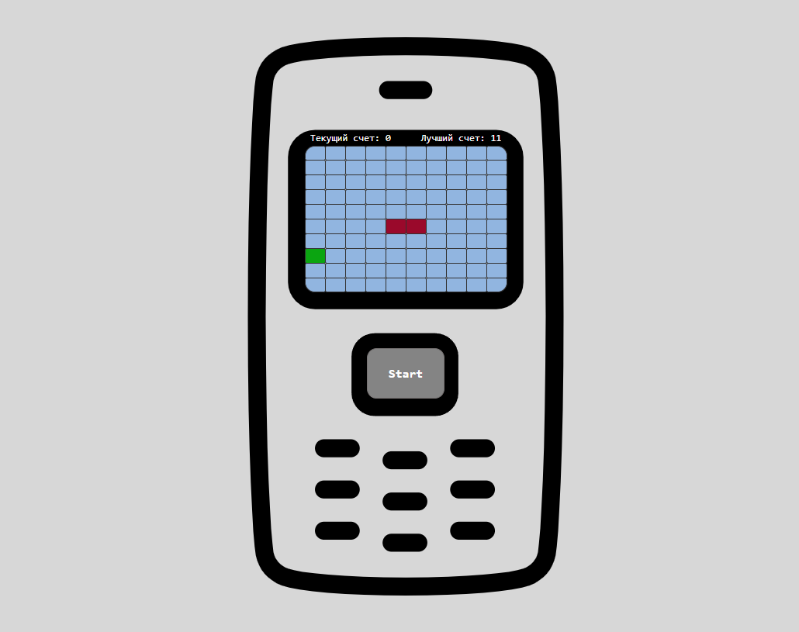

# Snake_game_OOP

 

### With:
:heavy_check_mark: HTML  
:heavy_check_mark: CSS  
:heavy_check_mark: JS  

### Without:
:x: Preprocessors 
:x: Libraries 
:x: Frameworks 
:x: Pixel-Perfect 
:x: Responsive-Design

#### Original layout: :x:
